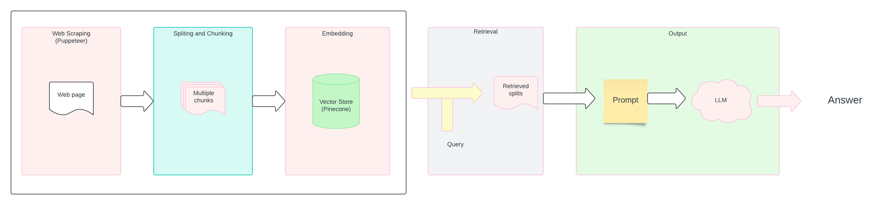

# Go Highlevel Assignment

I used Puppeteer for scraping webpages to fetch dynamic content efficiently. The image below illustrates the high-level architecture of the system.

## Architecture



## Backend

The backend follows the RAG architecture for creating a knowledge base. It uses MongoDB for metadata storage and Pinecone for vector storage.

Initially, I incorporated Redis and RabbitMQ, considering the need to recursively call webpages to a certain depth. However, I later dropped this approach due to time constraints.

Starting the server is straightforward:

Web Server:

```cmd
// Run for web server in prod mode
npm run webserver:start
```

Worker Process:

```cmd
// Run for worker in prod mode
npm run worker:start
```

I utilized langchain.js, which provides most of the LLM data integration out of the box.

## Frontend

I created a Vite-React app with TypeScript, using Ant Design as the design library and Tailwind CSS for styling.

The app has two main components:

1. Adding Site
2. Getting Answers for the Site Data

(Loom shows more about the UI)

To start the development server:

```cmd
// Dev Mode
npm run dev

// Build for prod
npm run build
```

## Deployments

For deployments, I used AWS EC2 for the backend and Vercel for the frontend. Unfortunately, I encountered a roadblock during the deployment of the worker process because Linux lacks some Chromium binaries, causing crashes when `browser.launch()` is called. A potential solution might involve using a Docker image if more time is available.

### Demo

https://gohighlevel-assignment.vercel.app/

In above link, adding of site won't work due to Chromium issue. But in the loom it shows end-to-end working.
